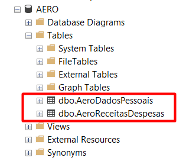
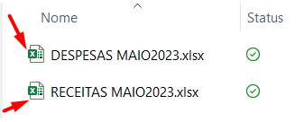
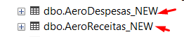
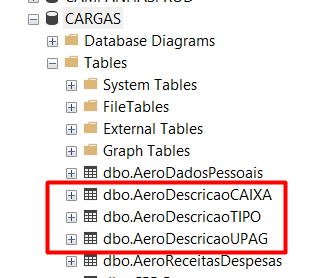

# Tabela Campanhas2 AeroReceitasDespesas rotina mensal de atualização
---
## Essa documentação descreve o processo de atualização da tabela AeroReceitasDespesas
---

>1. Antes de mais nada importe as tabelas de **AeroDadosPessoais** e **AeroReceitasDespesas** do **servidor de Produção** para o **servidor de ETL**, pois vamos precisar principalmente da tabela de AeroDadosPessoais para consumir higienização presente até o mes da atualização.

<div align="center">
    
</div>

---

>2. Recebimento dos arquivos mensais, geralmente em .csv ou .xlsx. Essas são apenas as duas fontes enviadas para esse produto até o momento, nenhum outro dado até então foi enviado para complemento.

<div align="center">
    
</div>
---

>3. Subir cada arquivo para uma tabela no servidor de ETL: com os nomes AeroReceitas_New e AeroDespesas_New. O nome é importante pois as querys irão processar os dados de forma ordenada e correta.


<div align="center">
    
</div>
---


>4. Renomeie as colunas para adequar a regra do negócio

```sql
EXEC sp_rename 'CAMPANHAS2.DBO.AeroDespesas_NEW.[N O M E]','NOME','COLUMN'
EXEC sp_rename 'CAMPANHAS2.DBO.AeroReceitas_NEW.[N O M E]','NOME','COLUMN'
EXEC sp_rename 'CAMPANHAS2.DBO.AeroDespesas_NEW.N#ORDEM','MATRICULA','COLUMN'
EXEC sp_rename 'CAMPANHAS2.DBO.AeroReceitas_NEW.N#ORDEM','MATRICULA','COLUMN'
```
---

> 5. Faça o Union de Receitas_NEW e Despesas_NEW do mês e grave em outra tabela chamada **AeroReceitasDespesas_NEW** ja com todos os campos iguais a da tabela em produção.

```sql
SELECT  
    CAST([TIPO] AS int)                   AS TIPO
   ,CAST(NULL AS nvarchar(150))           AS DESC_TIPO
   ,CAST([POSTO] AS nvarchar(50))         AS POSTO
   ,CAST([NOME] AS nvarchar(150))         AS NOME
   ,CAST([MATRICULA] AS nvarchar(50))     AS MATRICULA
   ,CAST([CPF] AS bigint)                 AS CPF
   ,CAST([UPAG] AS nvarchar(50))          AS UPAG
   ,CAST(NULL AS nvarchar(150))           AS DESC_UPAG
   ,CAST([VALOR] AS decimal(18,2))        AS VALOR
   ,CAST([PRAZO] AS nvarchar(50))         AS PRAZO
   ,CAST([CAIXA] AS nvarchar(50))         AS CAIXA
   ,CAST(NULL AS nvarchar(50))            AS DESC_CAIXA
   ,CAST(NULL AS nvarchar(150))           AS DESCRICAO
   ,CAST(NULL AS nvarchar(150))           AS TIPO_DESCONTO
   ,CAST(NULL AS nvarchar(150))           AS INCIDENCIA_MARGEM
   ,CAST('Despesas' AS nvarchar(10))      AS ORIGEM         --Importante, diz de onde veio o dado.
INTO CAMPANHAS2..AeroReceitasDespesas_New
FROM CAMPANHAS2..AeroDespesas_NEW

UNION ALL

SELECT  
    CAST([TIPO] AS int)                   AS TIPO
   ,CAST(NULL AS nvarchar(150))           AS DESC_TIPO
   ,CAST([POSTO] AS nvarchar(50))         AS POSTO
   ,CAST([NOME] AS nvarchar(150))         AS NOME
   ,CAST([MATRICULA] AS nvarchar(50))     AS MATRICULA
   ,CAST([CPF] AS bigint)                 AS CPF
   ,CAST([UPAG] AS nvarchar(50))          AS UPAG
   ,CAST(NULL AS nvarchar(150))           AS DESC_UPAG
   ,CAST([VALOR] AS decimal(18,2))        AS VALOR
   ,CAST([PRAZO] AS nvarchar(50))         AS PRAZO
   ,CAST([CAIXA] AS nvarchar(50))         AS CAIXA
   ,CAST(NULL AS nvarchar(50))            AS DESC_CAIXA
   ,CAST(NULL AS nvarchar(150))           AS DESCRICAO
   ,CAST(NULL AS nvarchar(150))           AS TIPO_DESCONTO
   ,CAST(NULL AS nvarchar(150))           AS INCIDENCIA_MARGEM
   ,CAST('Receitas' AS nvarchar(10))      AS ORIGEM         --Importante, diz de onde veio o dado.
FROM CAMPANHAS2..AeroReceitas_NEW

GO
```
>6. No campo UPAG existem codigos de localidades, e através de consultas efetuadas a documentação da Aeronáutica criamos uma tabela chamada AeroUpags onde se encontra a descrição desses códigos. Faça o update na tabela AeroReceitasDespesas_NEW. Nos arquivos de Julho23 vieram UPAGs como texto e nao mais como número. Haviamos pesquisado atraves dos numeros para encontrar as descriçoes, agora temos que realizar essa consulta Com a tabela padrão para poder verificar a consistência desses dados.

```sql
  --Verificando os dados que vieram como texto com a tabela em produção.
SELECT DISTINCT A.CPF, A.NOME, A.UPAG, B.UPAG, B.DESC_UPAG
FROM CAMPANHAS2..AeroReceitasDespesas_New A
INNER JOIN CARGAS..AeroReceitasDespesas B ON A.CPF=B.CPF
WHERE ISNUMERIC(A.UPAG)=0

--Update dos NUMEROS de upag em relação a ultima tabela que esta em produção.
UPDATE A
SET A.UPAG=B.UPAG
FROM CAMPANHAS2..AeroReceitasDespesas_New A
INNER JOIN CARGAS..AeroReceitasDespesas B ON A.CPF=B.CPF
WHERE ISNUMERIC(A.UPAG)=0 


--No mes de julho veio nomes em vez de numeros
--Precisamos criar na tabela de AeroDescricaoUpag um campo novo com 
--esses valores para ficar mais facil o join
UPDATE A
SET A.UPAG= CASE
               WHEN A.UPAG ='AFA'         THEN '242501'
               WHEN A.UPAG ='BAAN'        THEN '60753'
               WHEN A.UPAG ='BACG'        THEN '60754'
               WHEN A.UPAG ='BAFL'        THEN '152601'
               WHEN A.UPAG ='BAFZ'        THEN '120601'
               WHEN A.UPAG ='BANT'        THEN '60746'
               WHEN A.UPAG ='BAPV'        THEN '60757'
               WHEN A.UPAG ='BASC'        THEN '60748'
               WHEN A.UPAG ='BASV'        THEN '120502'
               WHEN A.UPAG ='BREVET'      THEN '232006'
               WHEN A.UPAG ='CINDACTA II' THEN '351707'
               WHEN A.UPAG ='CLA'         THEN '411101'
               WHEN A.UPAG ='EEAR'        THEN '242502'
               WHEN A.UPAG ='EPCAR'       THEN '231401'
               WHEN A.UPAG ='GABAER'      THEN '60701'
               WHEN A.UPAG ='GAP AF'      THEN '60778'
               WHEN A.UPAG ='GAP BE'      THEN '60772'
               WHEN A.UPAG ='GAP BR'      THEN '60702'
               WHEN A.UPAG ='GAP CO'      THEN '60774'
               WHEN A.UPAG ='GAP DF'      THEN '160725'
               WHEN A.UPAG ='GAP GL'      THEN '332045'
               WHEN A.UPAG ='GAP LS'      THEN '231410'
               WHEN A.UPAG ='GAP MN'      THEN '60773'
               WHEN A.UPAG ='GAP RF'      THEN '60777'
               WHEN A.UPAG ='GAP RJ'      THEN '132021'
               WHEN A.UPAG ='GAP SJ'      THEN '442515'
               WHEN A.UPAG ='GAP SP'      THEN '142510'
               ELSE A.UPAG
            END
FROM CAMPANHAS2..AeroReceitasDespesas_New A
WHERE ISNUMERIC(A.UPAG)=0


--Alterando a coluna para int
ALTER TABLE CAMPANHAS2..AeroReceitasDespesas_NEW
ALTER COLUMN UPAG INT

--Update das UPAGs ja com os numeros corretos, com a tabela padrão de upags.
UPDATE A
SET A.DESC_UPAG=B.DESC_UPAG
FROM CAMPANHAS2..AeroReceitasDespesas_NEW A
INNER JOIN CARGAS..AeroDescricaoUPAG B ON A.UPAG=B.UPAG

```

---  


>7. Ficou definido que a tabela AeroDescricaoCAIXA ficará da forma que está. Apenas deletei registros duplicados conforme campo CAIXA onde estavam todos nulos. Desta forma são essas 3 tabelas que vamos precisar para fazer os updates das informações e devem ser mantidas em CARGAS.


<div align="center">
    
</div>

---

>7. No campo Tipo existem codigos de 1 a 6, e através de consultas efetuadas a documentação da Aeronáutica criamos uma tabela chamada AeroTipo onde se encontra a descrição desses códigos. Faça o update na tabela AeroReceitasDespesas_NEW

 ```sql
 UPDATE A
SET A.DESC_TIPO=B.DESC_TIPO
FROM CAMPANHAS2..AeroReceitasDespesas_NEW A
INNER JOIN CARGAS..AeroDescricaoTIPO B ON A.Tipo=B.Tipo

```
---

>8. Agora vamos fazer o update baseado no campo CAIXA tanto para Despesas quanto para Receitas.

 ```sql

UPDATE A
SET A.DESC_CAIXA=B.DESC_CAIXA
    ,A.DESCRICAO=B.DESCRICAO
    ,A.TIPO_DESCONTO=B.TIPO_DESCONTO
    ,A.INCIDENCIA_MARGEM=B.INCIDENCIA_MARGEM
FROM CAMPANHAS2..AeroReceitasDespesas_NEW A
INNER JOIN CARGAS..AeroDescricaoCAIXA B ON A.CAIXA=B.CAIXA

```
---
>9. ETL pronto nesse arquivo, agora vamos dar continuidade com a tabela AeroDadosPessoais em outro tutorial.