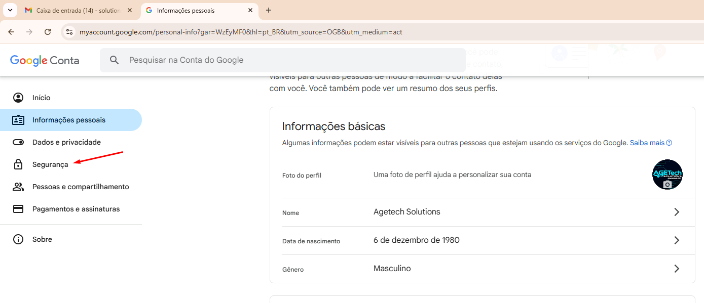
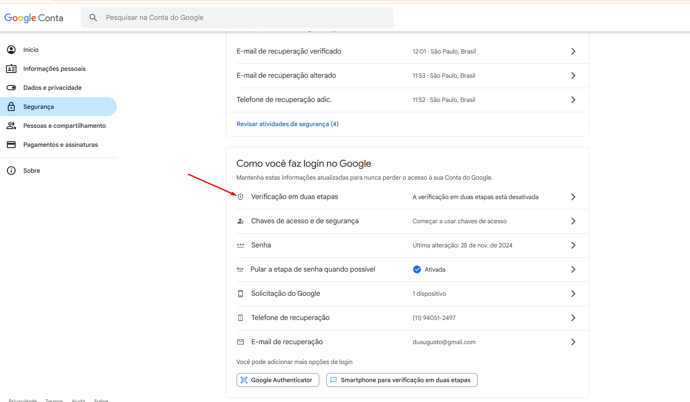
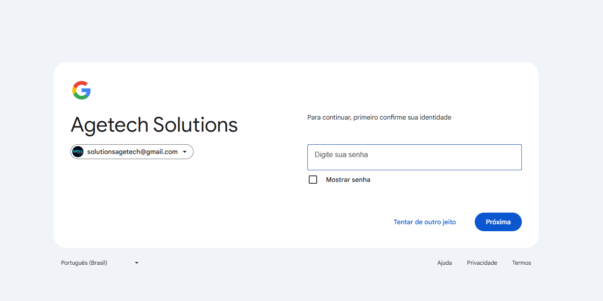

<h1 align="center">🚀 Criando chave de APP para o Gmail 🚀</h1> 

## Fluxo

- ➡️ O TypeBot por padrão requer uma senha de app
- ➡️ Esta senha será criada usando o email da agetech - solutionsagetech@gmail.com
- ➡️ Acesse a conta do gmail da agetech e vá em Gerenciar sua Conta do Google

    

- ➡️ Clique em Segurança: 

    

- ➡️ Clique em Segurança: 

    

- ➡️ Informe a senha: 

    

- ➡️ Ative a verificação de duas etapas se estiver desativada
- ➡️ Se a opção de Senhas de APP nao aparecer volte ate segurança va na lupa e procure
- ➡️ Senhas de app, coloque o nome TypeBot e copie a senha gerada.

