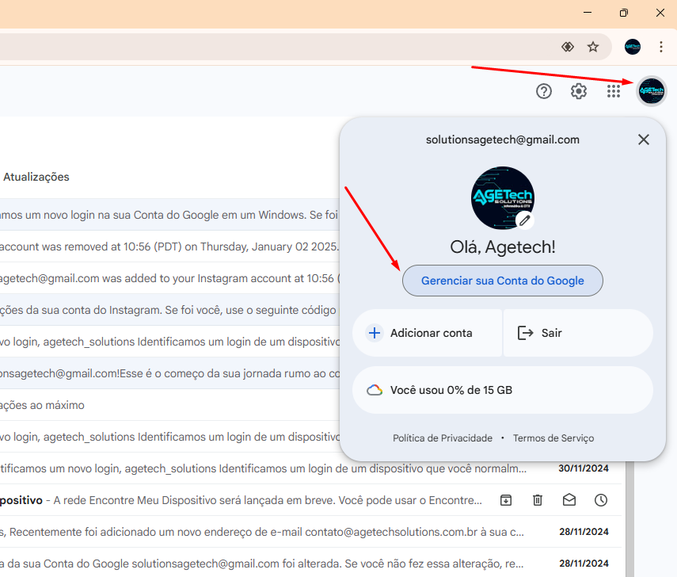

<h1 align="center">🚀 Criando chave de APP para o Gmail 🚀</h1> 

## Fluxo

- ➡️ O TypeBot por padrão requer uma chave de app
- ➡️ Esta chave será criada usando o email da agetech - solutionsagetech@gmail.com
- ➡️ Acesse a conta do gmail da agetech e vá em configurações
- ➡️ Crie um Diretório para o Typebot: 

    

