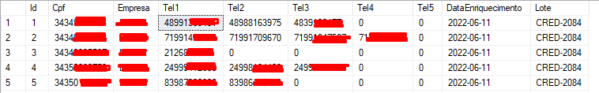
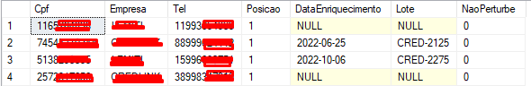
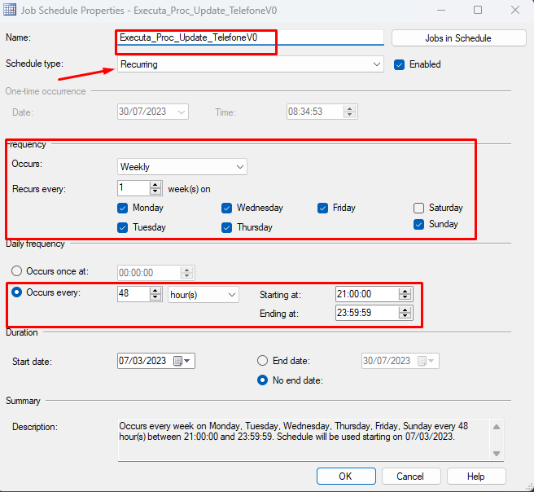

# Tabela CP..Telefone

## Atualização a cada 48 horas dos telefones da horizontal para vertical em Telefone_V0


> Tabela telefone na horizontal e deve ser mantida assim devido as atualizações constantes.
<div align="center">
    
</div>

---

> Tabela TelefoneV0 atualizada para vertical a cada 48 horas.


<div align="center">
    
</div>


```sql
USE [CP]
GO
/****** Object:  StoredProcedure [dbo].[sp_UpdateTelefoneV0]    Script Date: 30/07/2023 08:03:33 ******/
SET ANSI_NULLS ON
GO
SET QUOTED_IDENTIFIER ON
GO
-- ========================================================================================
-- Author:		EDUARDO AUGUSTO
-- Create date: 07/03/2023
-- Description:	Tabela CP..Telefone (Horizontal) CP..TelefoneV0 (Vertical)
-- ========================================================================================

ALTER PROCEDURE [dbo].[sp_UpdateTelefoneV0] 

AS	
BEGIN
	
	SET NOCOUNT ON;
		--1 Deletar a tabela CP..TelefoneV0_OLD, caso exista:
		IF OBJECT_ID('TelefoneV0_OLD', 'U') IS NOT NULL
		BEGIN
		    DROP TABLE TelefoneV0_OLD
		END
		
-------------------------------------------------------------------------------
--2 TABELA CP..Telefone Horizontal para CP..TelefoneV1 Vertical
        SELECT * INTO dbo.TelefoneV1 from
            (SELECT [Cpf]
              ,[Empresa]
              ,[Tel1] as Tel
              ,1 Posicao
              ,[DataEnriquecimento]
              ,[Lote]
              ,0 NaoPerturbe
            FROM [dbo].[Telefone]
             UNION
            SELECT [Cpf]
              ,[Empresa]
              ,[Tel2] as Tel
              ,2 Posicao
              ,[DataEnriquecimento]
              ,[Lote]
              ,0 NaoPerturbe
            FROM [dbo].[Telefone]
             UNION
            SELECT [Cpf]
              ,[Empresa]
              ,[Tel3] as Tel
              ,3 Posicao
              ,[DataEnriquecimento]
              ,[Lote]
              ,0 NaoPerturbe
            FROM [dbo].[Telefone]
             UNION
            SELECT [Cpf]
              ,[Empresa]
              ,[Tel4] as Tel
              ,4 Posicao
              ,[DataEnriquecimento]
              ,[Lote]
              ,0 NaoPerturbe
            FROM [dbo].[Telefone]
             UNION
            SELECT [Cpf]
              ,[Empresa]
              ,[Tel5] as Tel
              ,5 Posicao
              ,[DataEnriquecimento]
              ,[Lote]
              ,0 NaoPerturbe
            FROM [dbo].[Telefone]
            ) A
		  where tel is not null and Tel<>0
		
-----------------------------------------------------------------------------------------
--3 Update TelefoneV1 onde v1.tel=v0.tel [CP].[dbo].[TelefoneV0].[NaoPerturbe]
         UPDATE      A
         SET         A.[NaoPerturbe] = B.[NaoPerturbe]
         FROM        [CP].[dbo].[TelefoneV1] A
         INNER JOIN  [CP].[dbo].[TelefoneV0] B ON A.[Tel] = B.[Tel]
         WHERE B.[NaoPerturbe] =1
		
----------------------------------------------------------------------------------------
--4 Criar indice na tabela nova gerada CP..TelefoneV1
         CREATE NONCLUSTERED INDEX [IDX_TF_Cpf] ON [dbo].[TelefoneV1]
         (
             [Cpf] ASC
         )WITH (PAD_INDEX = OFF, STATISTICS_NORECOMPUTE = OFF, SORT_IN_TEMPDB = OFF, DROP_EXISTING = OFF, ONLINE = OFF, ALLOW_ROW_LOCKS = ON, ALLOW_PAGE_LOCKS = ON, OPTIMIZE_FOR_SEQUENTIAL_KEY = OFF) ON [PRIMARY]
         
		
--------------------------------------------------------------------------------------
--5 Renomear a tabela em uso de CP..TelefoneV0 para CP..TelefoneV0.old 
		EXEC sp_rename 'TelefoneV0', 'TelefoneV0_OLD';
		
--------------------------------------------------------------------------------------
--6 Renomear a tabela nova gerada CP..TelefoneV1 para CP..TelefoneV0
		EXEC sp_rename 'TelefoneV1', 'TelefoneV0';

END

```
---

> Job criado no SQl Agent.

<div align="center">
    
</div>